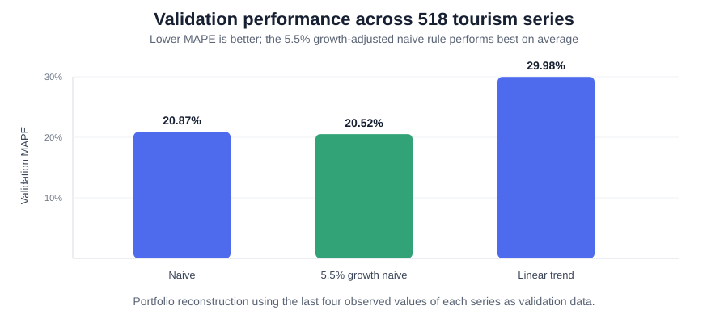
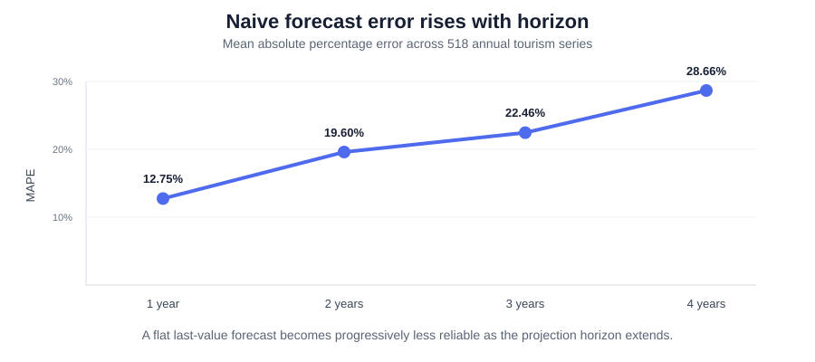

# Tourism Forecasting Competition — 518 Annual Time Series

A completed and audited reconstruction of my MSc **Predictive Business and Finance (EM1415)** project, *The Forecasting Tourism 2010 Competition*.

> **Repository-name note:** this was an unused private legacy repository in my GitHub account. The connected GitHub tool can populate existing repositories but cannot rename or create repositories, so the repository slug is temporarily unrelated to the project. The project title and contents below are authoritative.

## Key results

Across **518 heterogeneous annual tourism series**, the **5.5% growth-adjusted naive forecast** achieved the lowest average validation error among the three simple rules considered: **20.52% MAPE**, compared with **20.87%** for the flat naive benchmark and **29.98%** for a fitted linear trend.



The second important result is horizon sensitivity: the naive forecast's MAPE rises from **12.75% at one year** to **28.66% at four years**.



**Interpretation.** More flexible extrapolation is not automatically better. A modest growth adjustment improves the scale-free error metrics slightly, while an unconstrained linear trend performs substantially worse on average. In addition, in-sample MAPE and validation MAPE correlate only **0.427**, reinforcing the importance of out-of-sample evaluation.

## Project question

How well do simple forecasting rules generalize across a large collection of heterogeneous annual tourism-demand series, and what do scale-free error measures reveal about performance across forecast horizons?

The coursework dataset contains **518 annual time series** stored in a 43-row matrix. A key audit finding is that the series do **not** all contain 43 observations: they have different numbers of leading missing values, with observed lengths ranging from **7 to 43 years** (mean **20.5 years**). Therefore the original global 39-row/4-row split was incorrect. The completed analysis reserves the **last four observed values of each individual series** for validation.

## Data audit

| Feature | Value |
|---|---:|
| Number of series | **518** |
| Matrix rows | **43** |
| Missing cells | **11,668** |
| Shortest observed series | **7 years** |
| Longest observed series | **43 years** |
| Mean observed length | **20.47 years** |
| Validation horizon | **4 years per series** |

Many series display upward trends, but their levels, growth rates and volatility differ substantially. The heterogeneous scales make raw MAE/RMSE unsuitable for averaging across all 518 series without normalization.

## Error measures

For cross-series comparison, I prioritize **MAPE** and **MASE**:

- **MAE** and **RMSE** are scale-dependent; high-volume destinations can dominate an average across series.
- **Average signed error** can cancel positive and negative errors and therefore understates forecast magnitude errors.
- **MAPE** is scale-free and interpretable as a percentage, but is undefined at zero and unstable near zero.
- **MASE** scales forecast error by the in-sample one-step naive error, is comparable across differently scaled series, and remains meaningful when values are not close to zero.

For a series \(y_1,\ldots,y_T\), the MASE scaling denominator is

\[
\frac{1}{T-1}\sum_{t=2}^{T}|y_t-y_{t-1}|.
\]

## Naive forecast results

The corrected one-step **training** naive forecast uses \(\hat y_t=y_{t-1}\). The four-year **validation** naive forecast repeats the last training observation at every horizon.

| Metric | Mean across 518 series |
|---|---:|
| Training MAPE | **15.87%** |
| Training MASE | **1.00** |
| Validation MAPE | **20.87%** |
| Validation MASE | **3.37** |

Training MASE equals 1 by construction for the one-step naive benchmark. The original RMarkdown reported zero training MAPE because it compared repeated copies of the last training value to themselves rather than using genuine one-step in-sample forecasts.

### Error by forecast horizon

| Horizon | MAPE | MASE |
|---:|---:|---:|
| 1 year | **12.75%** | **1.59** |
| 2 years | **19.60%** | **3.05** |
| 3 years | **22.46%** | **3.89** |
| 4 years | **28.66%** | **4.94** |

Forecast error rises sharply with the horizon, which is exactly what we would expect when a constant-last-value forecast is extrapolated several years into series that often trend.

## Comparing three simple forecasting rules

I compare:

1. **Naive:** \(\hat y_{T+h}=y_T\).
2. **5.5% growth-adjusted naive:** \(\hat y_{T+h}=y_T(1.055)^h\).
3. **Linear trend:** OLS of the observed series on a time index, extrapolated four years.

The 5.5% formula follows Baker & Howard's description of their annual-tourism competition method. The original coursework had mistakenly used the exponent \(h-1\), which would imply no growth at the one-year horizon.

| Method | Validation MAPE | Validation MASE |
|---|---:|---:|
| Naive | 20.87% | 3.37 |
| **5.5% growth naive** | **20.52%** | **2.87** |
| Linear trend | 29.98% | 3.74 |

The growth-adjusted naive rule performs best on average under both MAPE and MASE in this reconstruction. The simple linear trend performs substantially worse, illustrating that extrapolating a fitted trend can be fragile when series are short, volatile or structurally changing.

The training/validation MAPE correlation across the 518 naive forecasts is only **0.427**, so in-sample predictability is an imperfect guide to out-of-sample performance.

## Completed coursework questions

### Why multiply the naive forecast by 1.055?

The adjustment incorporates **domain and empirical knowledge**: tourism demand had shown broad long-run growth, so a flat random-walk forecast systematically ignores a plausible positive drift. It is a deliberately simple way to embed a common growth prior into the naive baseline.

### Linear-regression specification

For each series separately:

- dependent variable: observed tourism demand \(y_t\);
- predictor: time index \(t\);
- model: \(y_t=\alpha+\beta t+\varepsilon_t\).

Future tourism demand is forecast by evaluating the fitted line at \(T+1,\ldots,T+4\).

### Problems with polynomial-order selection

Choosing among first- through fifth-order polynomials using the same validation information risks **selection overfitting**. Higher-order polynomial extrapolation is also unstable outside the observed time range. A more defensible workflow would use rolling-origin time-series cross-validation and compare models on strictly held-out origins.

### Candidate exponential-smoothing models

Reasonable candidates depend on observed structure: SES for approximately level series; Holt's method for trend; damped-trend Holt where long-run extrapolation should flatten; and Holt-Winters/ETS specifications when seasonal series are considered. The dataset in this repository is the annual subset, so seasonal Holt-Winters terms are not relevant to these 518 annual series themselves.

### Automating forecast combinations

Instead of hand-tuned weights, ensemble weights can be estimated with rolling-origin validation, constrained least squares, inverse-error weighting, or stacking. Constraints such as non-negative weights summing to one can improve interpretability and guard against extreme combinations.

### Competition objective versus real tourism planning

A leaderboard metric treats all series as an abstract forecast set. Real tourism planning also cares about asymmetric costs of over- versus under-forecasting, capacity constraints, revenue, staffing, policy shocks, events, destination-specific information and uncertainty intervals. A practical system would therefore add exogenous predictors, scenario analysis, forecast distributions, rolling re-estimation and decision-specific loss functions.

## Repository structure

```text
├── README.md
├── R/
│   └── tourism_forecasting.R
├── analysis/
│   └── validate_forecasts.py
├── data/
│   └── README.md
├── docs/
│   └── coursework_audit.md
├── figures/
│   ├── horizon_error.svg
│   └── model_comparison.svg
├── results/
│   ├── model_comparison.csv
│   ├── horizon_metrics.csv
│   ├── naive_train_validation_summary.csv
│   └── first5_linear_trend_forecasts.csv
└── requirements.txt
```

## Reproduce the audit

Place the recovered course file as `data/tourism_data.csv`, then run:

```bash
pip install -r requirements.txt
python analysis/validate_forecasts.py --data data/tourism_data.csv
```

An R implementation following the same series-specific split is provided in `R/tourism_forecasting.R`.

## Provenance

The numerical results above were recomputed from the original 518-series CSV recovered from my MSc coursework folder. They are **portfolio reconstruction results**, not claims that these corrected outputs appeared in the submitted assignment. The audit document records which original answers were incomplete or incorrect.

## Author

**Maha Gasim**  
MSc Data Analytics for Business and Society, Ca' Foscari University of Venice
